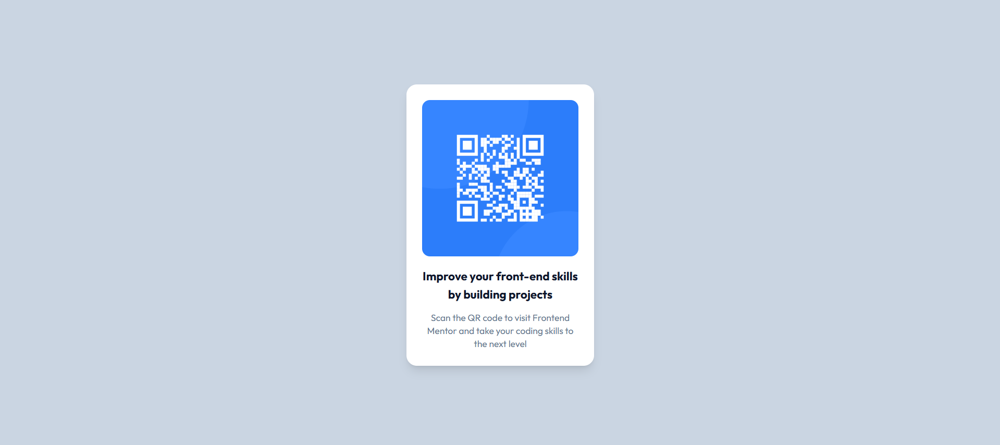

# 🧩 Proyecto: Componente QR Code

Este proyecto consiste en el desarrollo de un **componente de Código QR** utilizando **Astro** y **Tailwind CSS**.  
El objetivo es aplicar los conocimientos sobre **componentes**, **maquetación**, **estilos responsivos** y **utilidades CSS** para construir un diseño limpio, moderno y adaptable a diferentes dispositivos.

---

## 📖 Descripción general

### 🧩 Vista previa del proyecto
Agrega aquí una **captura de pantalla** del resultado final de tu componente.  
> Puedes usar la herramienta de captura del navegador o cualquier software de tu preferencia.


---

### 🔗 Enlaces del proyecto

- **Repositorio en GitHub:** [Agrega aquí la URL de tu repositorio](https://github.com/Yuki-23151302/qr-code-component)
- **Sitio desplegado (opcional):** [Agrega aquí la URL del proyecto desplegado, si usaste Vercel o Netlify](https://qr-code-component-yuki-23151302s-projects.vercel.app/)

---

## 🧠 Proceso de desarrollo

### 🛠️ Tecnologías utilizadas
Las herramientas y tecnologías utilizadas en el desarrollo de este proyecto fueron:

- Astro
- Tailwind CSS
- HTML5 semántico
- CSS
- Diseño responsivo (Mobile-first)
- Componentes reutilizables

---

### 💡 Lo que aprendí
Durante el desarrollo de este proyecto reforcé mis conocimientos sobre la creación de interfaces utilizando herramientas modernas de desarrollo web. Aprendí a crear componentes utilizando Astro y a aplicar estilos de manera eficiente con Tailwind CSS.

También pude practicar la organización de un proyecto, el uso de HTML semántico y la forma de replicar un diseño siguiendo una guía de estilo. Además, comprendí mejor cómo centrar elementos dentro de la página y cómo aplicar estilos responsivos para que el componente se vea correctamente en diferentes tamaños de pantalla.

Por ejemplo, utilicé clases de Tailwind para centrar el contenido en la pantalla y darle estilo al componente del código QR:

```html
<div class="bg-white rounded-2xl shadow-lg p-4 text-center">
  

  <h2 class="text-slate-900 font-bold mt-4">
    Improve your front-end skills by building projects
  </h2>

  <p class="text-slate-500 text-sm mt-2">
    Scan the QR code to visit Frontend Mentor and take your coding skills to the next level.
  </p>
</div>
```

---

### 🚀 Áreas de mejora

Algunos aspectos que podrían mejorarse o seguir practicándose en futuros proyectos son:

- Mejorar el manejo del diseño responsivo para distintos tamaños de pantalla.
- Practicar más el uso de utilidades avanzadas de Tailwind CSS.
- Organizar mejor la estructura del proyecto para hacerlo más escalable.
- Agregar efectos visuales como animaciones o transiciones para mejorar la experiencia del usuario.  

---

### 📚 Recursos útiles

Durante el desarrollo del proyecto se consultaron diferentes recursos de documentación y guías de desarrollo web que ayudaron a comprender mejor el funcionamiento de Astro, Tailwind CSS y la maquetación en HTML.

Entre los recursos más útiles se encuentran las documentaciones oficiales de las tecnologías utilizadas y páginas de referencia sobre HTML, CSS y diseño responsivo.

- [Documentación de Astro](https://docs.astro.build)  
- [Guía oficial de Tailwind CSS](https://tailwindcss.com/docs)  
- [MDN Web Docs - HTML y CSS](https://developer.mozilla.org/es/)  
- [Guía de diseño responsivo](https://web.dev/responsive-web-design-basics/)  

---

### 👩‍💻 Autor

- Nombre completo:  Elvia Yuridia Flores Dueñas
- Carrera: TICS  
- Grupo: --
- Correo institucional: 23151302@aguascalientes.tecnm.mx

---

### ✨ Reflexión final

En lo personal este ejercicio se me hizo más sencillo que el segundo, ya que el diseño del componente era más simple y fue más fácil replicarlo siguiendo la maqueta proporcionada. Una de las partes que más disfruté fue trabajar con Tailwind CSS, ya que permite aplicar estilos de forma rápida y organizada.

Durante el desarrollo del proyecto reforcé conceptos importantes como la estructura semántica del HTML, el uso de componentes en Astro y la aplicación de estilos responsivos. En futuros proyectos me gustaría seguir practicando estas herramientas para mejorar mis habilidades en el desarrollo de interfaces web y crear diseños más complejos y funcionales.
